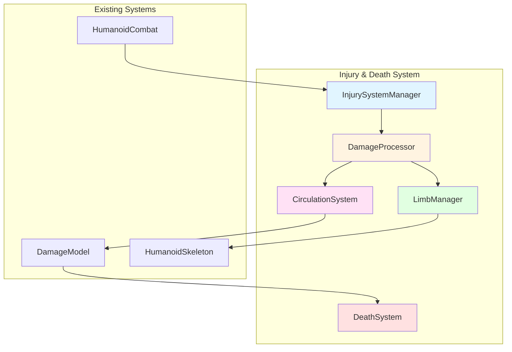
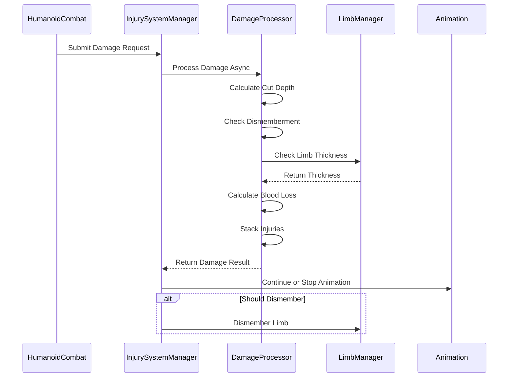
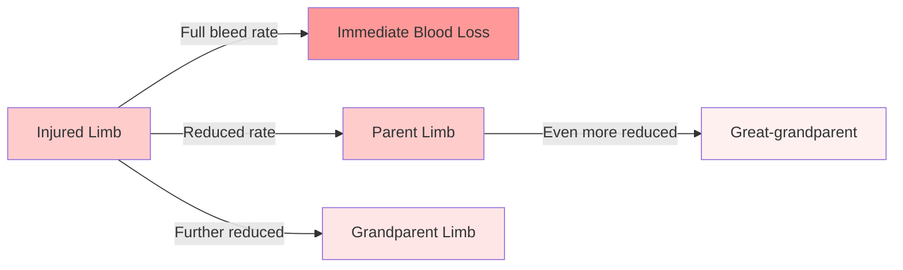
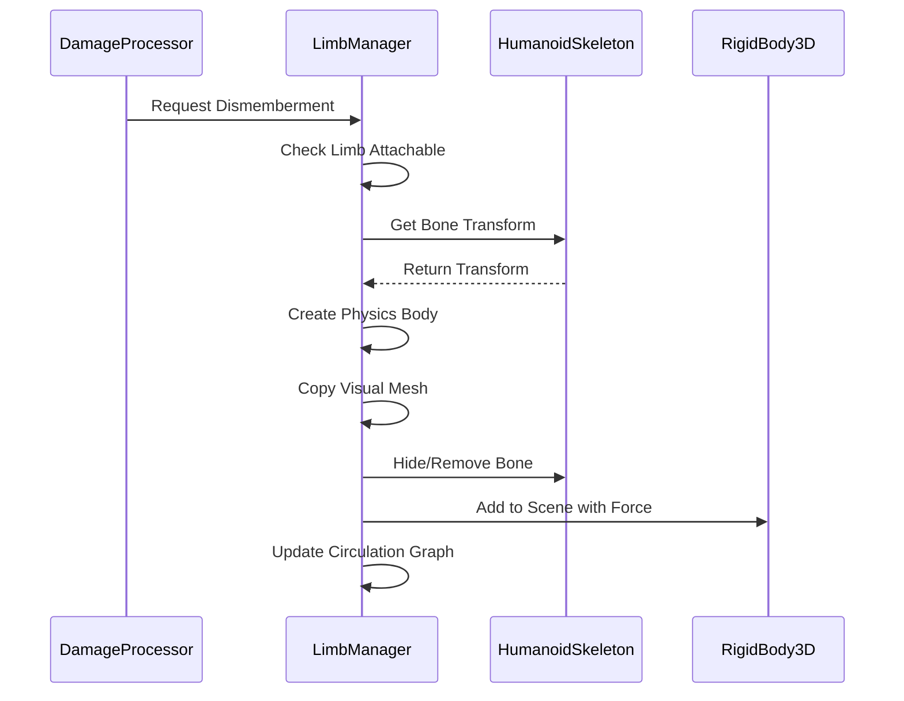
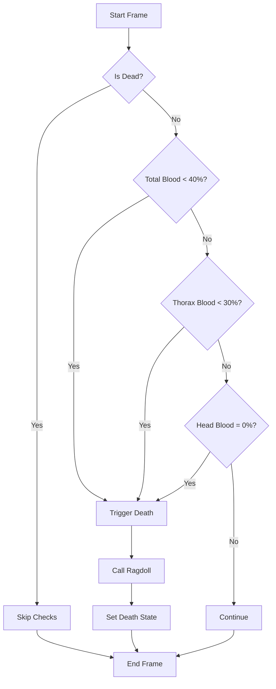
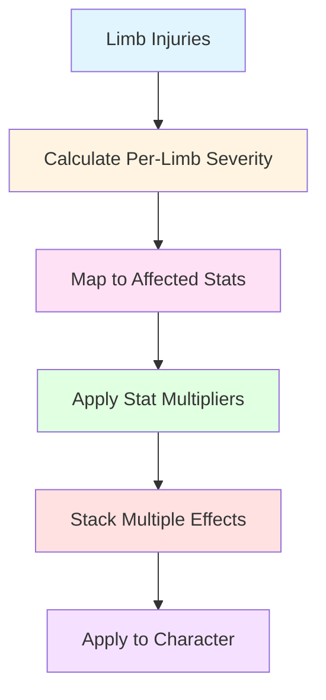

# Injury and Death System Architecture Plan

## Overview
This document outlines the architecture for an optimized, data-oriented injury and death system for the Godot 4.6.1 .NET project. The system extends existing bleedout and combat mechanics with limb dismemberment, pseudo blood circulation, asynchronous damage processing, and death conditions.

## System Architecture



## Data-Oriented Design Principles

### 1. Struct-Based Data Storage
All injury data will be stored in structs for cache efficiency:
- `LimbData` - Per-limb state
- `InjuryData` - Individual injury instances
- `CirculationNode` - Blood circulation graph nodes
- `DismembermentData` - Limb detachment state

### 2. SoA (Structure of Arrays) for Bulk Operations
Critical data arrays for efficient processing:
- `LimbBloodVolumes[]` - All limb blood volumes
- `LimbBleedRates[]` - All limb bleed rates
- `LimbInjuryCounts[]` - Per-limb injury counts

### 3. Entity Component Pattern
Each humanoid entity has:
- `InjuryComponent` - Core injury state
- `CirculationComponent` - Blood circulation state
- `DismembermentComponent` - Limb attachment state
- `DeathComponent` - Death condition tracking

## Core Components

### 1. InjurySystemManager
Central coordinator for all injury/death operations.

**Responsibilities:**
- Initialize injury components for humanoids
- Coordinate between damage processing, circulation, and death systems
- Manage asynchronous damage processing queue
- Provide extensibility hooks for future features

**Key Methods:**
```csharp
void InitializeInjurySystem(HumanoidModel humanoid);
Task ProcessDamageAsync(HitInfo hitInfo);
void UpdateInjurySystem(float delta);
void RegisterInjuryEffectModifier(IInjuryEffectModifier modifier);
```

### 2. DamageProcessor
Handles asynchronous damage calculation and application.

**Responsibilities:**
- Process damage requests asynchronously
- Calculate cut depth vs limb thickness
- Determine if dismemberment occurs
- Apply immediate blood loss and bleed rate changes
- Stack injuries on limbs

**Key Data Structures:**
```csharp
struct DamageRequest
{
    HitInfo HitInfo;
    DamageModule TargetLimb;
    CancellationToken Token;
}

struct DamageResult
{
    float ImmediateBloodLoss;
    float BleedRateIncrease;
    bool ShouldDismember;
    float CutDepth;
    float LimbThickness;
}
```

**Processing Flow:**


### 3. CirculationSystem
Manages pseudo blood circulation between limbs.

**Responsibilities:**
- Maintain limb hierarchy graph
- Propagate blood loss between connected limbs
- Calculate blood flow reduction based on distance from injury
- Track total and per-limb blood volume

**Limb Hierarchy Data Structure:**
```csharp
struct CirculationNode
{
    string LimbName;
    int ParentIndex; // -1 for root (thorax)
    List<int> ChildIndices;
    float BloodVolume;
    float MaxBloodVolume;
    float BleedRate;
    float DistanceFromHeart; // In circulation path steps
}

// Example hierarchy:
// Thorax (root, distance 0)
//   ├─ Head (distance 1)
//   ├─ Left Upper Arm (distance 1)
//   │   └─ Left Forearm (distance 2)
//   │       └─ Left Hand (distance 3)
//   ├─ Right Upper Arm (distance 1)
//   │   └─ Right Forearm (distance 2)
//   │       └─ Right Hand (distance 3)
//   ├─ Abdomen (distance 1)
//   │   └─ Pelvis (distance 2)
//   │       ├─ Left Thigh (distance 3)
//   │       │   └─ Left Shin (distance 4)
//   │       │       └─ Left Foot (distance 5)
//   │       └─ Right Thigh (distance 3)
//   │           └─ Right Shin (distance 4)
//   │               └─ Right Foot (distance 5)
//   └─ Neck (distance 1)
```

**Blood Propagation Algorithm:**


**Propagation Formula:**
```
bleedRateAtNode = sourceBleedRate * (1 - (distanceFromSource * 0.15))
```

### 4. LimbManager
Handles limb state and dismemberment.

**Responsibilities:**
- Track limb attachment state
- Manage limb thickness data
- Execute limb dismemberment
- Create physics objects for detached limbs
- Update skeleton after dismemberment

**Key Data Structures:**
```csharp
struct LimbState
{
    string Name;
    bool IsAttached;
    float Thickness;
    int BoneIndex;
    Node3D VisualNode;
    RigidBody3D PhysicsBody; // For detached limbs
}

struct DismembermentRequest
{
    string LimbName;
    Vector3 DetachPoint;
    Vector3 DetachForce;
}
```

**Dismemberment Process:**


### 5. DeathSystem
Monitors and executes death conditions.

**Responsibilities:**
- Track death condition states
- Check death criteria each frame
- Trigger ragdoll on death
- Prevent further damage after death

**Death Conditions:**
```csharp
enum DeathCondition
{
    TotalBloodBelow40Percent,
    ThoraxBloodBelow30Percent,
    HeadBloodAt0Percent
}

struct DeathState
{
    bool IsDead;
    DeathCondition? CauseOfDeath;
    float TimeOfDeath;
}
```

**Death Check Flow:**


### 6. InjuryEffectSystem
Applies injury effects to character stats.

**Responsibilities:**
- Calculate stat modifiers based on limb injuries
- Apply walkspeed, attack speed, and strength modifiers
- Stack multiple injury effects
- Provide extensibility for custom effects

**Key Data Structures:**
```csharp
struct InjuryEffect
{
    string AffectedLimb;
    float Severity; // 0.0 to 1.0
    StatType StatType;
    float Modifier; // Multiplier (e.g., 0.8 = 20% reduction)
}

enum StatType
{
    WalkSpeed,
    AttackSpeed,
    AttackStrength,
    StaminaRegen,
    MaxStamina
}

struct CharacterStatModifiers
{
    float WalkSpeedMultiplier;
    float AttackSpeedMultiplier;
    float AttackStrengthMultiplier;
    float StaminaRegenMultiplier;
    float MaxStaminaMultiplier;
}
```

**Effect Calculation:**


## Integration with Existing Systems

### HumanoidCombat Integration
```csharp
// In HumanoidCombat.cs
public async Task<HitInfo> ScanForHitsSlash()
{
    // ... existing raycast code ...
    
    if (result.Count > 0)
    {
        HitInfo hitInfo = CollectHitInformation(result, currentWeapon, origin, weaponVelocity);
        
        // Submit to injury system for async processing
        await Humanoid.InjurySystem.ProcessDamageAsync(hitInfo);
        
        return hitInfo;
    }
    
    return new HitInfo();
}
```

### DamageModel Integration
```csharp
// DamageModel.cs becomes a data provider
// Damage processing moved to DamageProcessor
// Bleed calculations moved to CirculationSystem
```

### HumanoidSkeleton Integration
```csharp
// In HumanoidSkeleton.cs
public void DismemberLimb(string limbName, Vector3 detachPoint, Vector3 force)
{
    // Create physics body for detached limb
    // Remove/hide bone from skeleton
    // Update physical bones simulation
}
```

## File Structure

```
scenes/characters/humanoid/
├── injury/
│   ├── InjurySystemManager.cs       # Main coordinator
│   ├── DamageProcessor.cs           # Async damage handling
│   ├── CirculationSystem.cs         # Blood circulation
│   ├── LimbManager.cs               # Limb state & dismemberment
│   ├── DeathSystem.cs               # Death conditions
│   ├── InjuryEffectSystem.cs        # Stat modifiers
│   ├── data/
│   │   ├── LimbData.cs              # Struct definitions
│   │   ├── InjuryData.cs            # Injury instance data
│   │   ├── CirculationData.cs       # Circulation graph data
│   │   └── DismembermentData.cs     # Dismemberment state
│   └── interfaces/
│       ├── IInjuryEffectModifier.cs # Extensibility hook
│       └── IDamageReceiver.cs       # Damage receiver interface
```

## Extensibility Hooks

### 1. IInjuryEffectModifier
```csharp
public interface IInjuryEffectModifier
{
    void ApplyModifier(ref CharacterStatModifiers modifiers, InjuryData injury);
    float Priority { get; }
}
```

### 2. IDamageReceiver
```csharp
public interface IDamageReceiver
{
    Task ReceiveDamageAsync(DamageRequest request);
    bool CanReceiveDamage();
}
```

### 3. Custom Death Conditions
```csharp
public delegate bool DeathConditionDelegate(InjuryComponent injury);

public void RegisterDeathCondition(string name, DeathConditionDelegate condition);
```

## Performance Optimizations

### 1. Object Pooling
- Pool `DamageRequest` objects
- Pool `InjuryData` structs
- Pool detached limb physics bodies

### 2. Burst-Compiled Calculations
- Use Unity.Burst equivalents for Godot
- Compile critical math operations

### 3. Spatial Partitioning
- Optimize raycast queries
- Cache limb positions

### 4. Update Batching
- Process all damage requests in batch
- Update circulation in single pass
- Check death conditions once per frame

## Implementation Order

1. Create data structures (structs, enums)
2. Implement CirculationSystem with limb hierarchy
3. Implement DamageProcessor with async handling
4. Implement LimbManager with dismemberment
5. Implement DeathSystem with condition checking
6. Implement InjuryEffectSystem for stat modifiers
7. Create InjurySystemManager as coordinator
8. Integrate with existing HumanoidCombat
9. Add extensibility hooks
10. Performance optimization and testing

## Testing Considerations

- Unit tests for circulation propagation
- Integration tests for dismemberment
- Performance tests for async damage processing
- Edge case tests (multiple simultaneous hits, rapid dismemberments)
